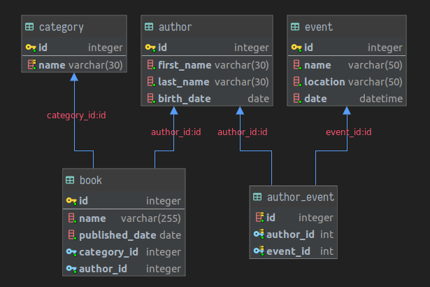

# SQL



## 1. Query

Based on the SQL diagram above, write the following queries:

**A.** Get authors with a last name beginning with "M" or who are born after 1950.

**Answer:**
```mysql
# Answer here
```

**B.** Count the number of books per category (empty categories too).

**Answer:**
```mysql
# Answer here
```

**C.** Find authors who wrote at least 2 books.

**Answer:**
```mysql
# Answer here
```

**D.** Get 50 authors with at least one event between the start and the end of this year.

**Answer:**
```mysql
# Answer here
```

**E.** Get the average number of books written by authors.

**Answer:**
```mysql
# Answer here
```

**F.** Get authors, sorted by the date of their latest event.

**Answer:**
```mysql
# Answer here
```

## 2. Database Structure

**A.** Based on the SQL diagram above, what can be done to improve the performance of this query ?

```mysql
SELECT id, name FROM book WHERE YEAR(published_date) >= '1973';
```

**Answer:** ?


**B.** Give 3 common good practice on a database structure to optimize queries.

**Answer:** 
 - ?
 - ?
 - ? 
