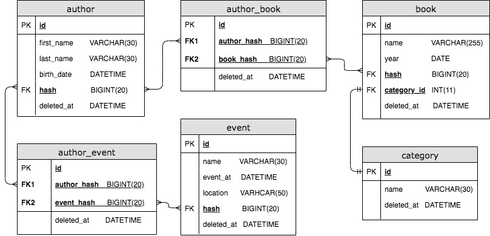

# SQL

## 1. Requêtages SQL

A. Ecrivez la requête qui permet de récupérer les auteurs (author) qui ont des événements (event) ordonnés par leur date (event_at) décroissante et dont les dates de softDelete (deleted_at) sont NULL.

B. Ecrivez la requête qui permet de compter le nombre de livres (book) regroupés par catégorie (category) (même ceux qui n’en ont pas) et dont les dates de softDelete (deleted_at) sont NULL.

C. Ecrivez la requête qui permet de récupérer un auteur qui a un event dont la date est comprise entre le début et la fin de cette année et dont les dates de softDelete (deleted_at) sont NULL, limiter le nombre de résultat à 50.

D. Ecrivez la requête qui permet de récupérer les auteurs qui ont au moins 2 livres et dont les dates de softDelete (deleted_at) sont NULL.

E. Ecrivez la requête qui permet de récupérer le nombre de livres moyen par auteur.

F. Ecrivez la requête qui permet de récupérer les auteurs qui ont un nom (last_name) qui commence par 'M' ou qui ont sont nés (birth_date) après 1950 et dont les dates de softDelete (deleted_at) sont NULL.

## 2. Architecture SQL

<pre>
SELECT first_name,last_name,gender,ipp FROM patient WHERE gender = 'male';
</pre>
Considérant le schéma et la requête ci-dessus, quelles optimisations sont possibles pour améliorer la rapidité de la requête.

## 3. Ecrivez une liste d'optimisations générique SQL